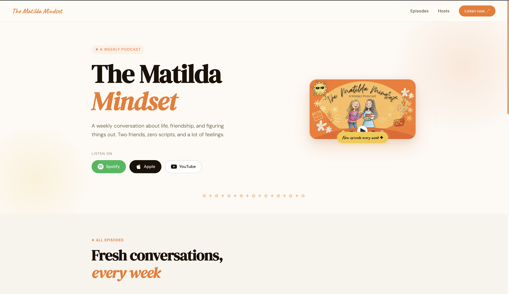

# The Matilda Mindset

> A weekly conversation about life, friendship, and figuring things out.



🎙️ [thematildamindset.com](https://thematildamindset.com) · [Spotify](https://open.spotify.com/show/21LLDfvzRzW2BH392gZMJr) · [Apple Podcasts](https://podcasts.apple.com/podcast/id1888385475) · [YouTube](https://www.youtube.com/playlist?list=PLt10RAma0oLCsGldRZlHhgXCI1rRBU9GK)

---

## What this is

The website for The Matilda Mindset podcast. Built from scratch as a learning project — React, TypeScript, and a lightweight AWS data layer so new episodes go live without a redeploy.

Episode data lives in S3. The site fetches it at runtime. Push a new episode via the admin panel, refresh the page — it's there.

---

## Stack

| Layer | Tech |
|---|---|
| Frontend | React 18 + TypeScript + Vite |
| Styling | CSS Modules |
| Routing | React Router v6 |
| Hosting | GitHub Pages |
| CI/CD | GitHub Actions |
| Data | AWS S3 (`episodes.json`) |
| API | AWS Lambda (Node.js 22, Function URL) |
| Auth | AWS Secrets Manager |
| DNS | AWS Route 53 |

---

## Project structure

```
src/
  components/
    Navbar.tsx
    Hero.tsx
    Episodes.tsx
    EpisodeCard.tsx
    Hosts.tsx
    Footer.tsx
  pages/
    EpisodePage.tsx       # /episodes/:id
  types.ts                # Episode, Host interfaces
  data.ts                 # static content (hosts, show links)
  App.tsx
.github/
  workflows/
    deploy.yml            # builds + deploys to GitHub Pages on push to main
docs/
  design.md               # full system design document
  screenshot.png
```

---

## Running locally

```bash
npm install
npm run dev
```

Opens at `http://localhost:5173`.

Episode data is fetched from the live S3 bucket at runtime — you'll see real episodes in local dev.

---

## Deploying

Push to `main`. GitHub Actions handles the rest:

1. Installs dependencies
2. Runs `npm run build`  
3. Deploys `dist/` to GitHub Pages

Live at [thematildamindset.com](https://thematildamindset.com) within ~2 minutes.

---

## Adding a new episode

Episodes are managed via the admin panel *(in progress)*. For now, update `src/data.ts` directly and push.

The full admin flow once built:
- Fill in episode form at `admin.thematildamindset.com`
- Hits Lambda → writes to `episodes.json` in S3
- Public site picks it up on next page load. No redeploy.

---

## Architecture

The short version:

```
Admin site  →  Lambda  →  S3 (episodes.json)
                                ↓
               Public site fetches at runtime
```

Full system design including sequence diagrams, data model, and AWS infrastructure breakdown: **[docs/design.md](docs/design.md)**

---

## Why build this instead of using a podcast website builder?

Mainly to learn TypeScript. Also because every template felt like every other podcast site — this one looks like The Matilda Mindset.

---

*Made with ✿*
