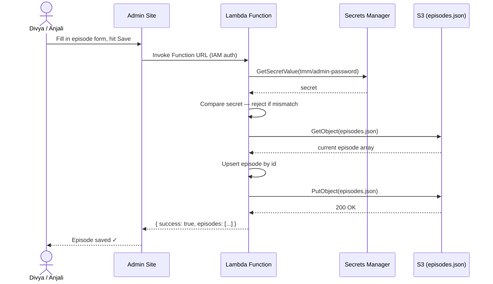
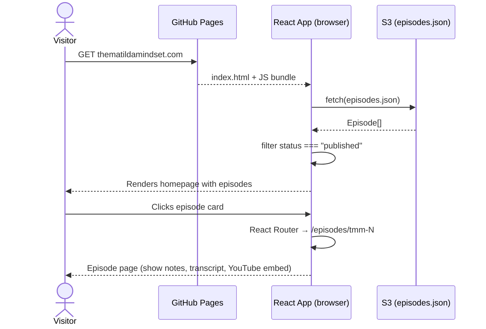
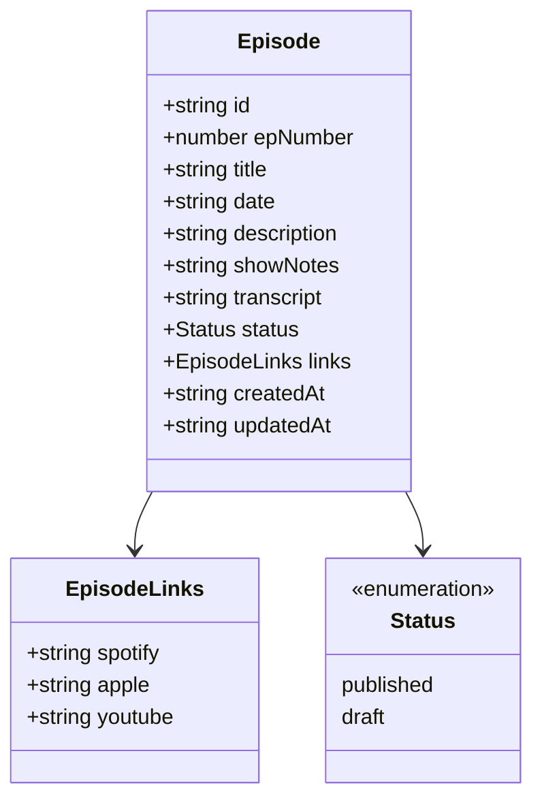

# The Matilda Mindset — System Design Document

**Version:** 1.0  
**Date:** April 2026  
**Author:** Divya  
**Stack:** React + TypeScript + Vite, AWS (S3, Lambda, Secrets Manager), GitHub Pages  

---

## Table of Contents

1. [Overview](#1-overview)
2. [Architecture](#2-architecture)
3. [Data Model](#3-data-model)
4. [Lambda API](#4-lambda-api)
5. [AWS Infrastructure](#5-aws-infrastructure)
6. [Public Site](#6-public-site)
7. [Admin Site](#7-admin-site)
8. [Episode Pages](#8-episode-pages)
9. [Design Decisions & Tradeoffs](#9-design-decisions--tradeoffs)
10. [Future Considerations](#10-future-considerations)

---

## 1. Overview

| | |
|---|---|
| **Public URL** | thematildamindset.com |
| **Admin URL** | admin.thematildamindset.com *(planned)* |
| **Hosting** | GitHub Pages (public site) + AWS (data layer) |
| **Domain** | AWS Route 53 → A records → GitHub Pages servers |
| **HTTPS** | Enforced via GitHub Pages TLS certificate |

The site is a React SPA deployed via GitHub Actions to GitHub Pages. Episode data lives exclusively in S3 — never hardcoded in the repository. The public site fetches episodes at runtime, so a new episode is live the moment it's saved in the admin panel. No redeployment needed.

---

## 2. Architecture

### 2.1 Admin write path



### 2.2 Public read path



### 2.3 DNS

```
thematildamindset.com  →  Route 53
                          A records → 185.199.108-111.153 (GitHub Pages)
                          CNAME www → divdiv8.github.io
```

---

## 3. Data Model

### 3.1 Episode interface



### 3.2 Field reference

| Field | Type | Notes |
|---|---|---|
| `id` | `string` | `"tmm-1"`, `"tmm-2"` — stable identifier, doubles as URL slug |
| `epNumber` | `number` | Renamed from `number` to avoid shadowing the TypeScript type |
| `title` | `string` | Full episode title |
| `date` | `string` | ISO 8601: `"2026-04-19"` |
| `description` | `string` | Short teaser (2–3 sentences). Shown on homepage cards. Used as SEO meta description. |
| `showNotes` | `string` | Full markdown — timestamps, links, headers. Rendered on episode page. Optional. |
| `transcript` | `string` | Full episode transcript. Rendered in a collapsible accordion on episode page. Optional. |
| `status` | `"published" \| "draft"` | Only `published` episodes render on the public site |
| `links.spotify` | `string` | Episode-level Spotify URL |
| `links.apple` | `string` | Episode-level Apple Podcasts URL |
| `links.youtube` | `string` | Episode-level YouTube URL |
| `createdAt` | `string` | ISO timestamp. Set once on creation. |
| `updatedAt` | `string` | ISO timestamp. Updated on every upsert. |

### 3.3 episodes.json

S3 stores a single flat JSON array. No wrapper object. S3's `Last-Modified` header is used if the client ever needs to check freshness.

```json
[
  {
    "id": "tmm-4",
    "epNumber": 4,
    "title": "Episode title",
    "date": "2026-04-19",
    "description": "Short teaser shown on the homepage card.",
    "showNotes": "## Timestamps\n\n- 00:00 Intro\n- 05:30 Main topic",
    "transcript": "Full transcript text here...",
    "status": "published",
    "links": {
      "spotify": "https://open.spotify.com/episode/...",
      "apple": "https://podcasts.apple.com/...",
      "youtube": "https://youtube.com/watch?v=..."
    },
    "createdAt": "2026-04-19T10:00:00Z",
    "updatedAt": "2026-04-19T10:00:00Z"
  }
]
```

---

## 4. Lambda API

Single Lambda function, invoked via Function URL. All requests require a `secret` field authenticated against Secrets Manager.

### 4.1 Authentication

Every request body must include:

```json
{ "secret": "••••••••" }
```

Lambda retrieves the stored value from Secrets Manager and compares. Mismatch returns `HTTP 401`.

### 4.2 Operations

#### `list`

Returns all episodes (published + draft). Used by the admin site only — the public site reads S3 directly.

```json
{ "action": "list", "secret": "••••••••" }
```

#### `upsert`

Creates or updates an episode matched by `id`. On create: sets `createdAt` and `updatedAt`. On update: sets `updatedAt` only. Writes the full array back to S3.

```json
{
  "action": "upsert",
  "secret": "••••••••",
  "episode": { }
}
```

#### `delete`

Removes an episode by `id` and writes the updated array back to S3. S3 versioning acts as a safety net for accidental deletes.

```json
{ "action": "delete", "secret": "••••••••", "id": "tmm-3" }
```

---

## 5. AWS Infrastructure

### 5.1 S3

| | |
|---|---|
| **Bucket name** | `tmm-episodes` |
| **Object key** | `episodes.json` |
| **Versioning** | Enabled — free accidental-deletion recovery |
| **Public access** | `episodes.json` is publicly readable via bucket policy. Bucket listing is disabled. |
| **CORS** | `GET` allowed from `thematildamindset.com` and `admin.thematildamindset.com` |

### 5.2 Lambda

| | |
|---|---|
| **Runtime** | Node.js 22 |
| **Trigger** | Lambda Function URL (no API Gateway) |
| **Auth** | `AWS_IAM` — admin site uses AWS SDK with restricted IAM credentials |
| **Memory** | 128 MB (reads and writes a tiny JSON file) |
| **Permissions** | Read/write on `tmm-episodes` bucket + read on `tmm/admin-password` secret only |

### 5.3 Secrets Manager

| | |
|---|---|
| **Secret name** | `tmm/admin-password` |
| **Value** | Shared password known to Divya and Anjali |
| **Rotation** | Manual — update in AWS Console, share out of band |
| **Cost** | ~$0.40/month |

### 5.4 IAM

Two IAM identities:

- **Lambda execution role** — `s3:GetObject`, `s3:PutObject` on `tmm-episodes`; `secretsmanager:GetSecretValue` on `tmm/admin-password`
- **Admin site IAM user** — `lambda:InvokeFunctionUrl` only. No S3 or Secrets Manager access directly. Credentials stored as environment variables in the admin site deployment.

---

## 6. Public Site

### 6.1 Episode fetching

On mount, the `Episodes` component fetches `episodes.json` from S3, filters to `status === "published"`, and renders. No caching — S3 is fast enough at this scale and freshness matters on launch day.

```typescript
const res = await fetch("https://tmm-episodes.s3.amazonaws.com/episodes.json");
const all: Episode[] = await res.json();
const published = all.filter(e => e.status === "published");
```

### 6.2 data.ts (static)

`data.ts` is retained for content that never changes per episode:

- Host names and bios
- Show-level platform links (Spotify show, Apple show, YouTube playlist)
- Show tagline and description

Episode data is no longer imported from `data.ts`.

---

## 7. Admin Site

### 7.1 Authentication

Password prompt on load. The password is sent with every Lambda request — no session token or cookie. Stateless by design. Two people use this — Cognito is overkill.

### 7.2 Navigation tabs

| Tab | Status | Notes |
|---|---|---|
| Episodes | Live | Episode list + form |
| Analytics | Placeholder | "Coming soon" in v1 — see section 10 |

### 7.3 Episode list view

All episodes from the `list` action, sorted by `epNumber` descending. Each row shows a status badge (`published` / `draft`) and three action buttons:

- **Edit** — opens the form pre-filled
- **Publish / Unpublish** — toggles `status` via `upsert`
- **Delete** — confirmation prompt before calling `delete`

### 7.4 Episode form

*Screenshot placeholder — to be added*

| Field | Input type | Notes |
|---|---|---|
| Episode number | Number input | Auto-generates `id` as `tmm-{epNumber}` |
| Title | Text input | |
| Date | Date picker | |
| Description | Textarea | Short teaser, 2–3 sentences |
| Show notes | Markdown editor | Full show notes with timestamps, links, headers |
| Transcript | Textarea | Optional — collapses on episode page |
| Spotify link | URL input | Episode-level |
| Apple link | URL input | Episode-level |
| YouTube link | URL input | Episode-level |
| Status | Toggle | `published` / `draft` |

On save: calls `upsert`. Shows success/error inline. No page reload.

---

## 8. Episode Pages

### 8.1 URL structure

```
thematildamindset.com/episodes/tmm-1
thematildamindset.com/episodes/tmm-2
thematildamindset.com/episodes/tmm-N
```

The `id` field is the URL slug — no additional field needed.

### 8.2 Page content

*Screenshot placeholder — to be added*

- Episode number badge + date
- Full title (h1)
- Platform links — Spotify, Apple, YouTube (episode-level)
- YouTube embed (if `links.youtube` is present)
- Show notes — rendered markdown (timestamps, links, headers)
- Transcript — collapsible accordion, closed by default
- ← Back to all episodes

### 8.3 Routing

React Router added to the public site:

```
/               →  Homepage (hero, episode list, hosts)
/episodes/:id   →  Individual episode page
```

**GitHub Pages deep link fix:** GitHub Pages serves `404.html` for unknown paths. A redirect script in `404.html` forwards to `index.html` with the path as a query param. React Router restores it on load.

### 8.4 Show notes format

`description` is plain text (homepage card + SEO meta). `showNotes` is markdown — rendered with `react-markdown`. Plain text in `showNotes` renders as a single paragraph, so there's no migration needed when moving from plain text to markdown.

### 8.5 SEO

Each episode page sets its own `<title>` and `<meta name="description">` using the episode title and first 160 chars of `description`. Implemented with `react-helmet`. This is how individual episodes get indexed by Google.

---

## 9. Design Decisions & Tradeoffs

| Decision | Why | Tradeoff |
|---|---|---|
| S3 as data store (no DB) | Zero ops, free tier, sufficient for a small append-mostly catalog | No server-side querying — filtering/sorting done client-side |
| No API Gateway | Lambda Function URLs are simpler and free. Traffic is <10 admin users. | No throttling, no usage plans, no built-in logging dashboard |
| No CDN | S3 latency is fine at this scale. CDN adds complexity. | Slightly slower for international listeners |
| Password auth (not Cognito) | Anjali needs access without an AWS account | No audit trail, no per-user sessions. Fine for 2 admins. |
| Episodes fetched at runtime | New episodes are live immediately. No redeploy needed. | S3 request on every page load — negligible cost |
| S3 versioning enabled | Free accidental-deletion recovery | Tiny storage cost increase |
| Flat JSON array (no DB) | Simple, readable, versionable in S3 | Not suitable if episode count grows to thousands (it won't) |

---

## 10. Future Considerations

- **Analytics** — episode play counts and per-platform link click tracking via a Lambda redirect service at `go.thematildamindset.com/spotify/tmm-4`. Logs click → forwards to Spotify/Apple/YouTube. Data stored in S3 or DynamoDB.
- **RSS auto-sync** — optional weekly GitHub Action that fetches the Riverside RSS feed and upserts any new episodes into S3 automatically as a fallback.
- **Search** — client-side episode search on the already-fetched array. No backend needed.
- **Email list** — simple opt-in form on the homepage (Mailchimp or ConvertKit).
- **Show notes editor** — replace the textarea with a proper markdown editor (e.g. `@uiw/react-md-editor`) in the admin form.

---

*The Matilda Mindset · thematildamindset.com · 2026*